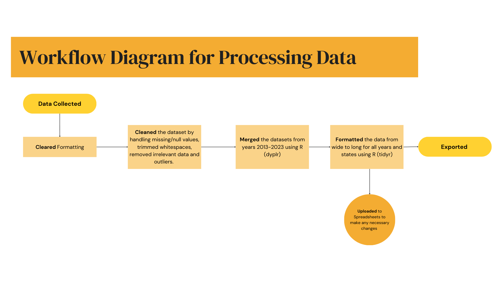
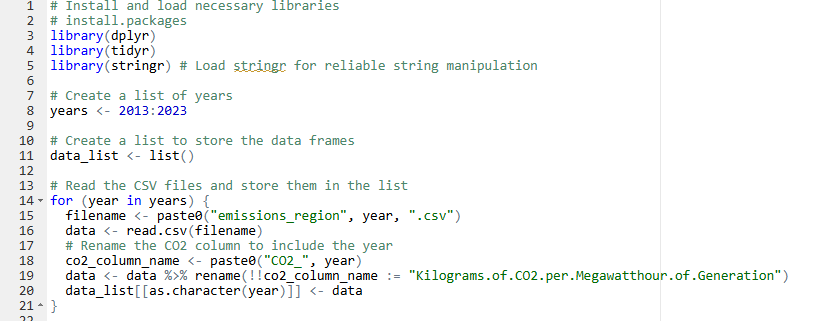
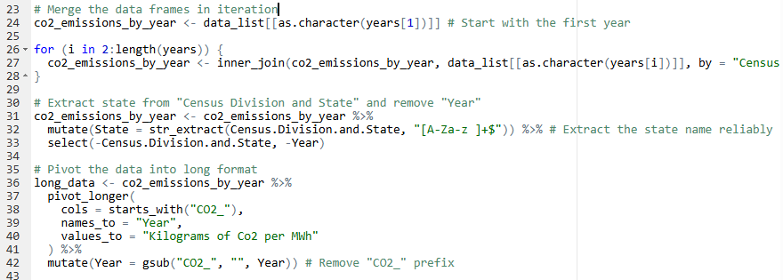
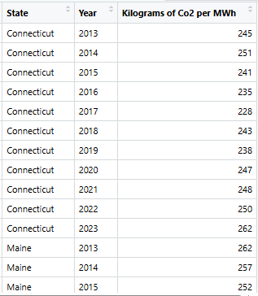
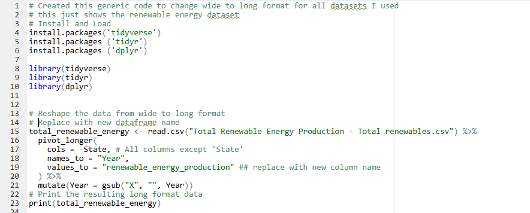
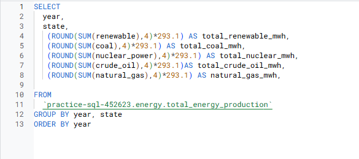
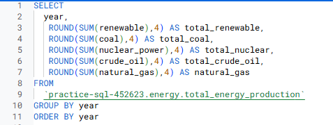
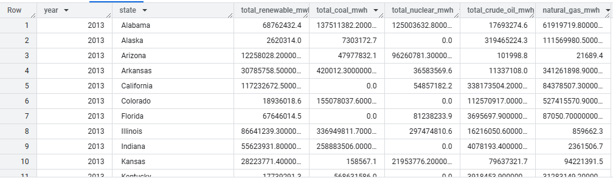
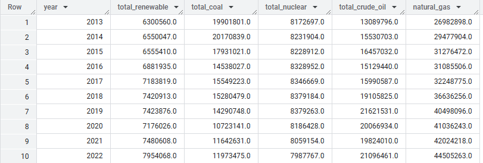
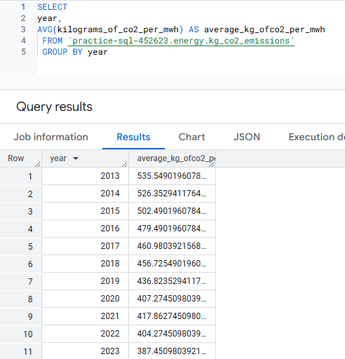

# Project 1: Energy Analysis

## Objective

The objective of this project was to analyze data between CO2 Emissions per MWh Generation and Energy Source Production throughout 2013-2023 in the United States.  

### **Data Preprocessing & Processing**
  
    Datasets:
     
    Kg of Carbon Emissions: https://www.eia.gov/electricity/data/emissions/

    Carbon Emissions (million metric tons): https://www.eia.gov/environment/emissions/state/

    Energy Production: https://www.eia.gov/state/seds/seds-data-complete.php#Production
    
    Tools Used: Spreadsheets, R, SQl

   

The original format of the raw data that was downloaded from the EIA database stored data in the wide format and were all in separate data files. To begin analysis I needed to merge the data files for each year and then format the files from wide to long. This is where R came in handy!

**R Code Used for Merging and Formatting the CO2 Emissions Data files:**

**Code Summary:** The code performs a series of data manipulation tasks to combine, clean, and reshape CO2 emissions data from multiple CSV files, resulting in a merged and reshaped format for the dataset.

First, we will install and load in the necessary packages in R. Then we will create a vector that contains the years from 2013 to 2023, which represents our data files. 
We will need to also create an empty list where our dfs will be stored once our CSV files are read. The **for loop** is then used to iterate through every year in the "years" vector. The CSV files are read and put into a df named data. The dplyr function **rename()** changes the original CO2 column name to the shorter, year specific name. 

I then need to merge the data frames for each year. The code starts off with the data from the first year and creates a new df. The **for loop** is then used to iterate through the remaining years. The **inner join** function then merges the current co2_emissions_by_year df with the df for the current year, based on the common column "Census.Division.and.State". This combines the data from all years into one single wide data frame.

I used **mutate()** to extract the state name and added "[A-Za-z ]+$" to make sure all state names remained the same, which included the spaces (e.g. "New Hampshire", "New Jersey", etc.)

The original "Census.Division.and.State" and "Year" columns were no longer needed.

Now I need to format the data from wide to long where the years are my rows. 
Pivot_longer() was used to reshape the data, where I specified columns starting with "CO2_" were to be pivoted. I created new "year" and "Kilograms of CO2 per MWh" columns containing the values. Mutate() was then used to remove "CO2_" prefix from the "Year" column. 

I viewed the data and exported the table for analysis. 

(Note: extra columns that resulted from the original code were removed in spreadsheets)

**R Results for the CO2 Emissions Data files:**

**R Code Used for formatting (wide to long) for the Energy Production Data Files:**

**Code Summary:** This generic code performs a series of data manipulation tasks to reshape Energy Production data.

(Renewable Energy Data File shown as example)

All the Energy Production files were exported and merged in a spreadsheet.
  
 
   
   ### **Analysis**:
   
   Tools Used: SQL & Tableau

   1. **Created** the generic dataset and table for the analysis using SQL.
        
  
   2. **Aggregated and Grouped** the data using the SUM and AVG function for all energy resources by year and state. Also, converted British Thermal Units to Megawatthour (MWh) for each energy source.

 
  
  
 
  
  
  
  **SQL Results**

  These results give the total amount of Enery Production of all sources per year for every state.
  
    

  These results give the total amount of Energy Production of all Sources Per Year.
  
    

  This gives the average emission per year to find the percentage change of Kg of CO2 per MWh between 2013 to 2023, which was calculated to be 28%. 
  
  
   
  
   
   3. **Imported** my datasources to Tableau to begin creating Visualizations.
   
   
   
   
   4. **Created** a dashboard to showcase:

       - CO2 emissions over time for the past 10 years by each state.

       - Total Energy Resource Distribution by state.

       - CO2 Emissions and Energy Resource Distribution
         
[View my Tableau Dashboard Here!](https://public.tableau.com/views/EnergyEmissions_17426711319470/EnergyEmissions?:language=en-US&:sid=&:redirect=auth&:display_count=n&:origin=viz_share_link)
### Results
   
Analysis helped identify an overall decrease in average CO2 emissions per MWh of electricity generation across all 50 states between 2013-2023. This indicates that we are supplying our increased energy needs with cleaner resources. This is strongly due to a transition in global standards to reduce our carbon footprint. Industries, like renewables, have played a bigger role in our energy supply, while overall coal reliance has been on the downfall.

Some key findings include:
  
  1. Nuclear Energy is still a key contributor to the overall energy needs in the U.S., accounting for roughly 10%.

     - States like Illinois and Virginia mainly rely on nuclear energy as their primary energy source.
    
      
  2. Minimum and Maximum States for CO2 Emissions per MWh of Generation:
       
       - Vermont was identified as the state with the lowest CO2 Emission across all years of analysis, mainly due to its energy generation solely from renewables.
       - Wyoming was identified as the state with the highest CO2 Emission across all years of anaylsis, due to its energy generation mainly from coal (71%).
  
  3. On Average the U.S. has decreased its CO2 emissions per MWh of generation by 28% over the last 10 years (2013-2023).

## Files

- `data/`: Contains the dataset used for the analysis.
- `notebooks/`: Jupyter notebooks with code and analysis.

### Conclusion

Between 2013 and 2022, the U.S. demonstrated a significant 28% reduction in average CO2 emissions per MWh of electricity generation, driven by a shift towards cleaner energy sources. While nuclear power remains a key contributor, states like Vermont, relying solely on renewables, achieved the lowest emissions, contrasting sharply with coal-dependent Wyoming's high emissions. This trend reflects a broader global movement towards decarbonization, with renewables gaining prominence and coal declining.

### **Further Data Exploration**

1. Next steps in the project would have been analyzing data in the sectors, such as Residential, Commercial, Industrial & Transportation. This would have led to identifying key contributors for CO2 emissions and honing in on cleaner energy alternatives industries are taking to reduce their carbon footprint.

2. Diving deeper into AI and its energy demands.
 
  - The use of AI is increasing and so are its energy needs. The AI industry is quickly becoming the largest energy consumer on the global scale. Larger companies are looking for energy alternatives, that are both reliable 
    and sustainable to power the AI data centers. These alternatives the companies are pioneering for, include investing in renewables and being big proponents for nuclear.

  - Data analysis could lead to looking into companies who are powering AI and where their energy is coming from. This could help identify if companies are maintaining their carbon objectives.
  
  - Data analysis could also lead to forecasting the next 30 years of AI consumption and needed energy production. 
