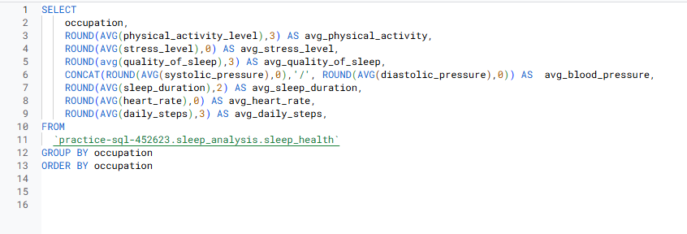
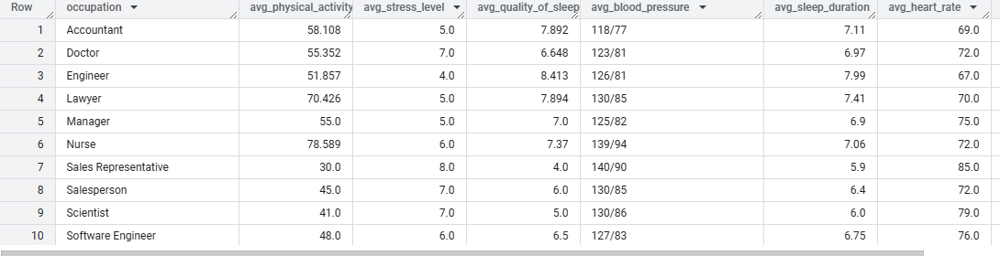

# Project 2: Sleep & Wellness

## Business Objective

To identify key lifestyle factors and demographic segments that significantly impact sleep quality and stress levels within the population represented in the dataset, and to develop actionable recommendations for targeted wellness programs or interventions aimed at improving sleep health and reducing stress.

### Data Preprocessing & Processing

Note: Data was collected from this [Kaggle Dataset](https://www.kaggle.com/datasets/uom190346a/sleep-health-and-lifestyle-dataset)

**Tools Used:** Spreadsheets

### Data Analysis 

**Tools Used:** SQL, Tableau

First, I wanted to aggregate the data to find the averages of key health metrics using SQL. 

I then used Tableau for further analysis. 

Using a scatter plot, I plotted average quality of sleep vs. average stress levels to see if there was any relationship between the two. 

### Results

Key takeaways:
1. There is an inverse relationship between average quality of sleep and average stress levels. Meaning as quality of sleep increases the level of stress decreases. R² is 0.79497, representing a reasonably strong relationship between sleep quality and stress levels.

2. There is a moderate positive correlation between average physical activity level and average quality of sleep (in minutes).

    - p-value: 0.0097255
    - R² value: 0.542564
    

4. Heart rate has a weak to moderate positive correlation with both systolic and diastolic blood pressure. This suggests that there's a slight tendency for blood pressure to increase with heart rate, but the relationship is not very strong.

    Pearson's coefficient between heart rate and systolic pressure: 0.294

    Pearson's coefficient between heart rate and diastolic pressure: 0.271

 
