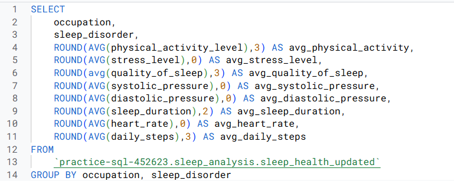

# Project 2: Sleep Health & Wellness 

## Business Objective

To identify key lifestyle factors that significantly impact sleep quality, stress levels, and overall wellness within the population represented in the dataset, and to develop actionable recommendations for targeted wellness programs or interventions aimed at improving sleep health and reducing stress.

### Data Preprocessing & Processing

Note: Data was collected from this [Kaggle Dataset](https://www.kaggle.com/datasets/uom190346a/sleep-health-and-lifestyle-dataset)

**Tools Used:** Spreadsheets

### Data Analysis 

**Tools Used:** SQL, R, Tableau

First, I wanted to aggregate the data to find the averages of key health metrics using SQL, specifically for the various occupations in the dataset.  

I did the same for people with Sleep Disorders and without to use later in the analysis. 

I then used Tableau and R for further analysis. 

Using a scatter plot, I plotted average quality of sleep vs. average stress levels to see if there was any relationship between the two depending on the occupation. Initial thoughts included seeing an inverse relationship, meaning increased quality of sleep led to decreased stress levels. 

I then plotted average physical activity and quality of sleep. I noticed that increased physical activity generally led to increased quality of sleep.

My thought process shifted then to other health and lifestyle factors, such as heart rate, blood pressure, and sleep disorders. 

The questions that arose:

1. Does heart rate increase with higher stress levels?

2. Does higher blood pressure indicate higher heart rate based on occupation?

I believed the best way to answer the first question was to create another scatter plot to see the relationship.

To answer the second question, I wanted to find out the Pearson's correlation coefficient (r) value and p-value between heart rate and blood pressure. I used R to do so.

The next step in the process was to see if there was a statistical significance between stress levels and quality of sleep for people with a sleeping disorder versus without. 

I used the independent samples t-test. 

Since the p-value was <0.05 between stress levels of people with and without sleep disorders, meaning there was a statistical significant difference between the two.  

### Results

1. There is an inverse relationship between average quality of sleep and average stress levels. Meaning as quality of sleep increases the level of stress decreases. R² is 0.79497, representing a reasonably strong relationship between sleep quality and stress levels.

2. There is a moderate positive correlation between average physical activity level and average quality of sleep (in minutes).

    - p-value: 0.0097255
    - R² value: 0.542564

3. The regression equation indicates a positive linear relationship between average heart rate and average stress level. This means that as average heart rate increases, average stress level also tends to increase.

Avg Stress Level = 0.174426 * Avg Heart Rate + -6.83985

    - p-value: 0.00526
    - R² value: 0.59772

The R-squared value suggests a moderately strong relationship. 

The p-value is statistically significant (p < 0.05). This means that the observed relationship between heart rate and stress level is unlikely to have occurred by chance. In other words, there is a statistically significant association between average heart rate and average stress levels.

4. Heart rate has a weak to moderate positive correlation with both systolic and diastolic blood pressure. This suggests that there's a slight tendency for blood pressure to increase with heart rate, but the relationship is not very strong. The p-value between systolic and diastolic pressure was 0.972 confirming the physiological relationship between the two.

    **Heart rate and systolic pressure:**
   
       - Pearson's coefficient: 0.477
  
       - p-value: 0.138 (no statistically significant linear relationship between these two variables in the dataset based 
         on occupation)

   **Heart rate and diastolic pressure:**

    - Pearson's coefficient: 0.369
  
    - p-value: 0.264 (no statistically significant linear relationship between these two variables in the dataset based on 
      occupation)

5. The results from t-test showed that the p-value was <0.05, which means there is a statistically significant difference in stress levels between the two groups (people with and without sleep disorders). The negative t-statistic suggests that the group with sleep disorders has a higher average stress level compared to the group without sleep disorders.

    t-test results for comparing stress levels between the two groups

    

6. For quality of sleep between the two groups, the results showed that since the p-value was >0.05, there is **not** a statistically significant difference in sleep quality between the two groups at the 0.05 alpha level. However, it is also important to note that if analysis was done on a larger dataset, a statistically significant difference may have existed between the two groups.

    t-test results for comparing quality of sleep between the two groups

   

### Conclusions

Occupations like sales representatives, scientists, and doctors, which often involve high-pressure environments, are associated with elevated stress levels and reduced sleep quality. In contrast, professions such as nursing, law, and engineering, while demanding, show a trend towards lower stress and improved sleep quality. This suggests that the nature of certain professions may inherently contribute to stress and sleep disturbances, highlighting the need for targeted interventions to promote well-being.

Occupations such as sales representatives and scientists tend to exhibit lower levels of physical activity and poorer quality of sleep. In contrast, professions like nursing and law demonstrate higher levels of physical activity and better quality of sleep. This pattern suggests a potential link between physical activity and sleep quality, emphasizing the importance of promoting active lifestyles for improved sleep.
 

The observed higher average heart rates among sales representatives and scientists, coupled with their reported increased stress levels, contrasts with the lower average heart rates seen in teachers, engineers, and accountants. This pattern highlights the potential physiological impact of stress in certain occupations and warrants further exploration of stress-reduction strategies.

People with sleep disorders showed significantly elevated stress levels compared to those without (p < 0.05), indicating a strong association between sleep disorders and increased stress.

## Actionable Recommendations for Wellness Programs

1. Companies could support employees by educating them on the impact of diet and habits of sleep. This can increase the amount of employees who now have knowledge about the importance of getting good quality sleep and how diet plays a factor in this. 

2. Companies can also offer a variety of physical activity options, including on-site fitness facilities, gym partnerships, collaborative 'field days,' and work sports teams/tournaments, to encourage regular exercise and promote engagement across departments.

3. We can also implement stress management programs, that foster a "no judgement" zone for employees suffering from increased stress. This can include, meditation workshops, time management and organizational skills trainings, as well as counseling or support groups. This can give access to resources for employees to improve their stress levels and overall wellness.

Further Data Exploration:

If I had more time and resources for this project I would have wanted to analyze data that directly related to performance levels of the listed employees. This would have enhanced my analysis and I would have constructed more specialized programs to increase performance if results were low. 
