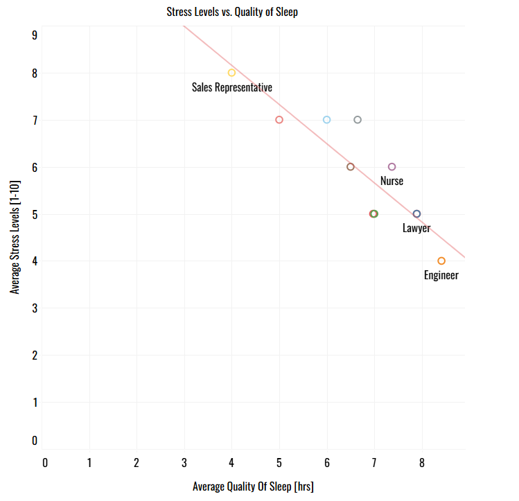
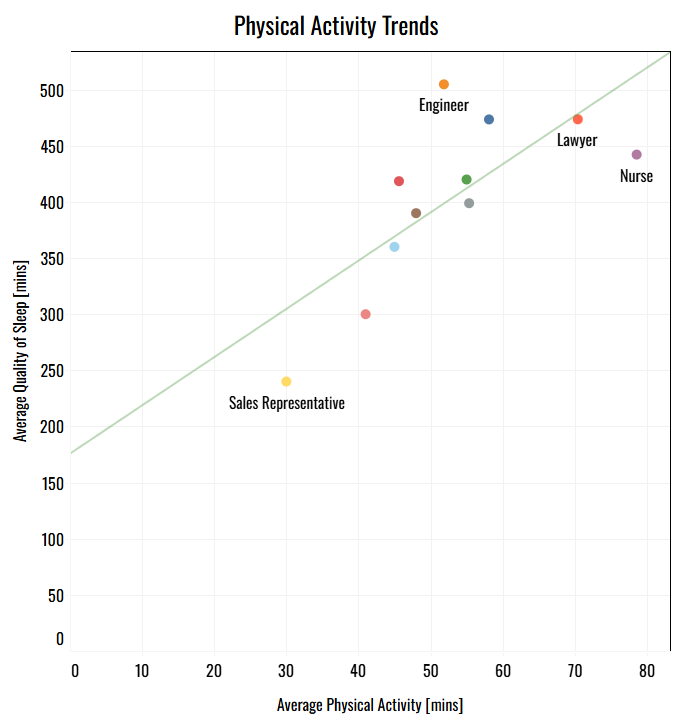

# Project 2: Sleep Health & Wellness 

## Business Objective

To identify key lifestyle factors that significantly impact sleep quality, stress levels, and overall wellness within the population represented in the dataset, and to develop actionable recommendations for targeted wellness programs or interventions aimed at improving sleep health and reducing stress.

### Data Preprocessing & Processing

Note: Data was collected from this [Kaggle Dataset](https://www.kaggle.com/datasets/uom190346a/sleep-health-and-lifestyle-dataset)

**Tools Used:** Spreadsheets

### Data Analysis 

**Tools Used:** SQL, R, Tableau

First, I wanted to aggregate the data to find the averages of key health metrics using SQL, specifically for the various occupations in the dataset.  

I did the same for people with Sleep Disorders and without to use later in the analysis. The highlighted "True" was changed to "False" to get the results for people without any sleep disorders.

I then used Tableau and R for further analysis. 

**I explored the data by occupation first:**

Using a scatter plot, I plotted average quality of sleep vs. average stress levels to see if there was any relationship between the two depending on the occupation. Initial thoughts included seeing an inverse relationship, meaning increased quality of sleep led to decreased stress levels. 

I then plotted average physical activity and quality of sleep. I noticed that increased physical activity generally led to increased quality of sleep.

My thought process shifted then to other health and lifestyle factors, such as heart rate, blood pressure, daily steps and sleep disorders. 

The questions that arose:

1. Does heart rate increase with higher stress levels depending on the occupation?

2. Does higher blood pressure indicate higher heart rate based on occupation?

I believed the best way to answer the first question was to create another scatter plot to see the relationship.

To answer the second question, I wanted to find out the Pearson's correlation coefficient (r) value and p-value between heart rate and blood pressure. I used R to do so.

The next step in the process was to see if there was a statistical significance between stress levels and quality of sleep for people with a sleeping disorder versus without. 

I used the independent samples t-test. 

### Results

**Based on Occupation:**

1. There is an inverse relationship between average quality of sleep and average stress levels. Meaning as quality of sleep increases the level of stress decreases. R² is 0.79497, representing a reasonably strong relationship between sleep quality and stress levels.

2. There is a moderate positive correlation between average physical activity level and average quality of sleep (in minutes).

    - p-value: 0.0097255
    - R² value: 0.542564
    

4. Heart rate has a weak to moderate positive correlation with both systolic and diastolic blood pressure. This suggests that there's a slight tendency for blood pressure to increase with heart rate, but the relationship is not very strong. The p-value between systolic and diastolic pressure was 0.972 confirming the physiological relationship between the two.

    **Heart rate and systolic pressure:**
   
       - Pearson's coefficient: 0.477
  
       - p-value: 0.138 (no statistically significant linear relationship between these two variables in the dataset based 
         on occupation)

   **Heart rate and diastolic pressure:**

    - Pearson's coefficient: 0.369
  
    - p-value: 0.264 (no statistically significant linear relationship between these two variables in the dataset based on 
      occupation)

5. The results from t-test showed that the p-value was <0.05, which means there is a statistically significant difference in stress levels between the two groups (people with and without sleep disorders). The negative t-statistic suggests that the group with sleep disorders has a higher average stress level compared to the group without sleep disorders.

    t-test results for comparing stress levels between the two groups

    

For quality of sleep between the two groups, the results showed that since the p-value was >0.05, there is **not** a statistically significant difference in sleep quality between the two groups at the 0.05 alpha level. However, it is also important to note that if analysis was done on a larger dataset, a statistically significant difference may have existed between the two groups.

    t-test results for comparing quality of sleep between the two groups

   

   

 
